# `wharton-ic`: Institutional Investment Research & Decision-Support Operating System

[](https://www.python.org/downloads/)
[](tests/)
[](LICENSE)
[](https://globalyouth.wharton.upenn.edu/competitions/investment-competition/)

`wharton-ic` is an institutional-quality, auditable, client-constrained investment operating system engineered specifically for high school teams competing in the **Wharton Global High School Investment Competition**.

It is **NOT** a generic algorithmic trading bot or black-box stock picker. Wharton does not primarily reward short-term simulated returns; it evaluates teams on **client alignment, strategic coherence, depth of analysis, disciplined portfolio construction, risk awareness, originality, and the ability to defend decisions**.

`wharton-ic` anchors the entire competition journey on a rigorous fiduciary pipeline:
$$\text{CLIENT} \to \text{STRATEGY} \to \text{RESEARCH} \to \text{EVIDENCE} \to \text{VALUATION} \to \text{PORTFOLIO} \to \text{RISK} \to \text{COUNCIL} \to \text{HUMAN SIGN-OFF} \to \text{MONITORING} \to \text{AUDIT TRAIL}$$

---

## 1. Non-Negotiable Core Design Principles

1. **Numbers from Code; Reasoning from Models**
   Language models are hard-coded to **never** perform authoritative financial arithmetic, portfolio optimization, valuation mathematics, factor rankings, or backtest returns in natural language prose. Vectorized Python libraries (`skfolio`, `scipy`, `pandas`, `cvxpy`, `statsmodels`) compute 100% of mathematical figures. Language models interpret, challenge assumptions, construct bull/bear theses, and synthesize evidence.
2. **Point-in-Time Integrity (Zero Look-Ahead Leakage)**
   Historical analyses and backtests strictly enforce `filing_date <= as_of_date`. Future fundamentals, restatements, or prices cannot contaminate historical states.
3. **Evidence Before Assertion**
   The Evidence Auditor automatically cross-references every qualitative claim against verified deterministic data, tagging statements as `[FACT]`, `[CALCULATION]`, or `[INFERENCE]`.
4. **Client First**
   No security is "good" in isolation. Every asset must serve an explicit strategic role (Core Compounder, Secular Growth, Defensive Cash Generator) mapped to client goals, horizon, liquidity, and ethical exclusions.
5. **Human Sovereign Approval**
   The platform is pure decision-support. No security can be purchased on the Wharton Investment Simulator without an explicit human student signature recorded in `15_human_decision.md`.
6. **Simple Must Beat Complex**
   Sophisticated models (Hierarchical Risk Parity, Mean-CVaR, multi-factor models) are rigorously benchmarked against naive Equal Weight and SPY baselines.

---

## 2. System Architecture

```mermaid
flowchart TD
    subgraph Config ["1. Configuration Layer (YAML)"]
        C1["client_mandate.yaml\n(Goals, Horizon, Values, Constraints)"]
        C2["competition.yaml\n(Wharton Rules: 10-20 Stocks, 15% Max Asset, 25% Sector)"]
        C3["risk.yaml\n(14% Target Vol, 20% Max DD, Fat-Tailed Scenarios)"]
    end

    subgraph Data ["2. Point-in-Time Data Engine"]
        D1["ApprovedUniverseEngine\n(Authoritative Wharton Securities)"]
        D2["PointInTimeStore\n(Filing date isolation)"]
        D3["YFinance & SEC EDGAR Adapters\n(Parquet disk cache)"]
    end

    subgraph Quant ["3. Deterministic Quantitative Engines"]
        Q1["Fundamental Forensics\n(ROIC, Sloan Accruals, Altman Z)"]
        Q2["FactorScreeningEngine\n(Winsorized Sector-Neutral Z)"]
        Q3["ValuationEngine\n(DCF, WACC, Reverse DCF, Comps)"]
        Q4["PortfolioOptimizer (skfolio)\n(HRP, CVaR, MinVol, MaxSharpe)"]
        Q5["Convex Constraint Projector (CVXPY)\n(Box Bounds & Sector Caps)"]
        Q6["WalkForwardBacktester\n(Rolling out-of-sample)"]
        Q7["ScenarioStressEngine\n(Student-t Monte Carlo 5,000 paths)"]
    end

    subgraph Council ["4. Multi-Model AI Council"]
        A1["Blind Phase A & B\n(Independent Model Evaluations)"]
        A2["Adversarial Debate\n(Bull vs. Bear Researcher)"]
        A3["Risk Officer & Client Steward Review"]
        A4["Evidence Auditor\n(Fact & Math Reconciliation)"]
        A5["Committee Chair Memo"]
    end

    subgraph Governance ["5. Auditability & Human Gate"]
        G1["Immutable Decision Ledger\n(00_metadata to 14_verdict)"]
        G2{"15_human_decision.md\n(Mandatory Student Signature)"}
        G3["PortfolioMonitor\n(Weight drift & thesis breach alerts)"]
    end

    subgraph Output ["6. Deliverables & Report Pack"]
        O1["outputs/report_pack/\n(Verified CSV/MD Tables & Captions)"]
        O2["outputs/charts/\n(Publication-Grade PNG Visuals)"]
        O3["AI_USE.md & ai_use_log.jsonl\n(Ethics & Attribution)"]
    end

    Config --> Data
    Data --> Quant
    Quant --> Council
    Council --> Governance
    Governance --> Output
```



---

## 3. Quick Start & Installation

### Prerequisites
- macOS or Linux
- Python 3.12+
- `uv` package manager (`curl -LsSf https://astral.sh/uv/install.sh | sh`)

### Installation
```bash
# Clone the repository
git clone https://github.com/raei-2748/caplet-investment.git wharton-ic
cd wharton-ic

# Create Python 3.12 virtual environment and install dependencies
uv venv --python 3.12
source .venv/bin/activate
uv pip install -e .

# Verify CLI installation
wharton-ic --help
```

### Run All Tests
```bash
# Run 100% of acceptance tests (Unit, Leakage, Regression, Integration)
pytest -v
```

---

## 4. Complete CLI Command Reference

| Command | Description |
|---|---|
| `wharton-ic demo` | **Runs full end-to-end competition demonstration workflow.** |
| `wharton-ic audit-references` | Displays forensic audit of past winning Wharton competitor repositories. |
| `wharton-ic ingest-official` | Ingests official Wharton competition files from `competition/official/`. |
| `wharton-ic update-data` | Refreshes local Parquet price caches and financial statements. |
| `wharton-ic screen` | Executes multi-factor cross-sectional screening across approved universe. |
| `wharton-ic research TICKER` | Displays audited point-in-time fundamentals, ROIC, and accrual metrics. |
| `wharton-ic value TICKER` | Runs deterministic DCF, WACC, Comps, Reverse DCF, and 2D Sensitivity. |
| `wharton-ic debate TICKER` | Executes adversarial Bull vs. Bear debate and Evidence Audit. |
| `wharton-ic propose TICKER` | Convenes multi-model council and generates immutable decision ledger. |
| `wharton-ic portfolio` | Runs all 8 `skfolio` optimizers with Wharton box & sector constraints. |
| `wharton-ic backtest` | Executes out-of-sample walk-forward backtest with turnover slippage. |
| `wharton-ic stress` | Runs 2008/2020/2022 crisis replays and 5,000-path fat-tailed Monte Carlo. |
| `wharton-ic monitor` | Scans portfolio for weight drift (>3%), sector caps, and thesis drawdowns. |
| `wharton-ic review TICKER` | Inspects decision ledger and human approval status. |
| `wharton-ic export-report-pack` | Exports verified tables, publication charts, and captions for Final Report. |

---

## 5. The Immutable Decision Ledger

Every investment considered by the team receives a dedicated, tamper-proof directory in `decisions/YYYY-MM-DD_TICKER/` containing 16 standardized artifacts:

```
decisions/2026-09-19_MSFT/
├── 00_metadata.json          # Decision ID, ticker, status, author, target weight
├── 01_client_fit.json        # Quantitative goal, horizon, liquidity, and values scores
├── 02_sources.json           # Raw SEC filings, URLs, retrieval timestamps, hashes
├── 03_fundamentals.json      # Audited ROIC, Net Debt/EBITDA, Altman Z, accruals
├── 04_valuation.json         # DCF cash flow schedules, WACC inputs, sensitivity matrix
├── 05_quant.json             # Factor percentiles, beta, annualized vol, tracking error
├── 06_macro.md               # Macroeconomic sensitivity and interest rate exposure
├── 07_independent_model_A.md # Blind independent report from Model Family A (OpenAI)
├── 08_independent_model_B.md # Blind independent report from Model Family B (Anthropic)
├── 09_bull_case.md           # Strongest evidence-backed upside thesis & variant perception
├── 10_bear_case.md           # Adversarial failure modes & thesis-breaking exit conditions
├── 11_risk.json              # Marginal volatility contribution & marginal CVaR
├── 12_portfolio_impact.json  # Post-trade sector concentration & correlation delta
├── 13_evidence_audit.json    # Classification into [FACT], [CALCULATION], [INFERENCE]
├── 14_committee_verdict.json # Council synthesis & target weight recommendation
└── 15_human_decision.md      # MANDATORY STUDENT SIGNATURE BLOCK
```

> [!IMPORTANT]
> **Human Approval Gate**: `15_human_decision.md` must be signed with `APPROVED` by a student team member before any trade can be placed on the Wharton Investment Simulator.

---

## 6. Official Wharton Files Ingestion

When official Wharton materials are released for the 2026–2027 competition, place them directly into `competition/official/`:
- `client_case.pdf`: Official client profile and mandate.
- `approved_securities.csv`: Official authorized stock and ETF list.
- `competition_rules.pdf`: WInS trading guidelines and constraints.

Then run:
```bash
wharton-ic ingest-official
```

---

## 7. AI Ethics & Wharton Policy Compliance

`wharton-ic` is strictly engineered to comply with Wharton's competition ethics policies:
- **No Unlabeled AI Prose**: All tables, metrics, and figure captions exported to `outputs/report_pack/` are generated deterministically by Python code.
- **Machine-Readable Audit Trail**: Every LLM interaction is recorded in `outputs/ai_use_log.jsonl` tracking model name, timestamp, prompt version, and role.
- **Student Ownership**: All investment theses, portfolio selections, and report text represent the independent intellectual work of high school team members.
- See [docs/AI_USE.md](docs/AI_USE.md) for our full disclosure text to include in the Final Report Appendix.

---

## 8. Documentation Sitemap

- [docs/architecture.md](docs/architecture.md): Deep architectural specification and subsystem data flow.
- [docs/reference_audit.md](docs/reference_audit.md): Forensic technical audit of 9 past winner & AI framework repositories.
- [docs/benchmark_against_previous_teams.md](docs/benchmark_against_previous_teams.md): Comparative infrastructure matrix vs past finalists.
- [docs/methodology.md](docs/methodology.md): Mathematical formulations for DCF, WACC, HRP, CVaR, and Monte Carlo.
- [docs/data_dictionary.md](docs/data_dictionary.md): Provenance fields, accounting variables, and risk metrics.
- [docs/decision_process.md](docs/decision_process.md): Human-in-the-loop decision governance manual.
- [docs/wharton_workflow.md](docs/wharton_workflow.md): Step-by-step student playbook from Day 1 to Final Report.
- [docs/AI_USE.md](docs/AI_USE.md): Ethical AI disclosure and compliance guidelines.
- [docs/THIRD_PARTY.md](docs/THIRD_PARTY.md): Provenance and open-source licensing acknowledgments.

---

## 9. Limitations & Technical Debt

1. **Market Data Provider Fallback**: While `yfinance` serves as a resilient, zero-cost data provider with local Parquet caching and synthetic fallbacks, high-frequency intraday tick data is out of scope (unnecessary for Wharton's long-term horizon).
2. **Options and Derivatives**: Per official Wharton competition rules, short-selling and derivatives are prohibited and intentionally unsupported.
3. **Execution Delay**: WInS simulator trades execute on market open/close; backtests assume execution at the next trading day's adjusted close with 5 bps slippage friction.

---

## 10. License
Distributed under the MIT License. See `LICENSE` for details.
All open-source libraries (`skfolio`, `scipy`, `cvxpy`, `pydantic`, `typer`) are utilized in full compliance with their respective BSD, Apache-2.0, and MIT licenses.
