# `wharton-ic`: Reference-Grounded Architecture & AI Council V2.1
## Institutional Decision-Support Operating System for Team Caplet

[](https://www.python.org/downloads/)
[](tests/)
[](LICENSE)
[](https://globalyouth.wharton.upenn.edu/investment-competition/)

`wharton-ic` is an institutional-grade, reference-grounded, client-constrained investment research and decision-support operating system engineered specifically for **Team Caplet** in the **2026–2027 Wharton Global High School Investment Competition**.

It is built around one foundational principle:

> **WHARTON IS THE ROOT CONFIGURATION.**
> - No guessed competition rules.
> - No invented judging weights.
> - No fake client constraints presented as real.
> - No previous-team strategy treated as authoritative.
> - No AI agent is allowed to substitute its own assumptions for official Wharton materials or student decisions.

---

## 1. The 7-Level Hierarchy of Authority

The system programmatically enforces an authority hierarchy across all code, models, and reports:

```
[Level 100] OFFICIAL_PRIVATE_VERIFIED
    └── Released Sept 15, 2026 via SurveyMonkey Apply (Client case, WInS trading limits, rubrics)
           │
[Level 80]  OFFICIAL_PUBLIC_VERIFIED
    └── Published on Wharton Global Youth webpages (Dates, team composition, ethics policy)
           │
[Level 60]  OFFICIAL_GUIDEBOOK_VERIFIED
    └── Official current competition guidebooks and participant FAQs
           │
[Level 40]  TEAM_INTERPRETATION
    └── Explicit deductions authored and signed by student team members
           │
[Level 20]  HISTORICAL_ONLY
    └── 2025 or earlier competition materials (Usable for benchmarking only; NEVER overrides current)
           │
[Level 10]  INSPIRATION
    └── Previous winning team repositories and strategies
           │
[Level 0]   AI_REASONING
    └── Model generation and argumentation — NEVER AUTHORITATIVE EVIDENCE
```

Any unknown private competition rule explicitly remains `UNKNOWN / AWAITING_OFFICIAL_MATERIAL` with confidence `0.0`. The system fails closed rather than inventing arbitrary constraints.

---

## 2. End-to-End System Architecture

```mermaid
flowchart TD
    subgraph RulesLayer ["1. Wharton Rule Custodian & Ingestion"]
        R1["wharton_public_2026_27.yaml\n(Verified Public Timeline & Philosophy)"]
        R2["wharton_private_2026_27.yaml\n(Placeholder awaiting Sept 15 release)"]
        R3["Official Material Ingestion\n(competition/official/2026_27/manifest.yaml)"]
        R4["RuleRegistry & ConflictDetector\n(Precedence: Private > Public > Historical)"]
    end

    subgraph ClientLayer ["2. Client Mandate Engine"]
        C1["Client Case PDF\n(SurveyMonkey Apply)"]
        C2["ClientMandate Schema\n(CLIENT_FACT vs INTERPRETATION vs ASSUMPTION)"]
        C3["ClientMandateAuditor\n(Objective Tensions & Citation Checks)"]
        C4["Human Client Approval Gate\n(wharton-ic client approve)"]
    end

    subgraph StrategyLayer ["3. Strategy Formation & Red Team"]
        S1["Strategy Architect A\n(Resilient Quality Moats)"]
        S2["Strategy Architect B\n(Structural Transitions)"]
        S3["Strategy Architect C\n(All-Weather Endowment)"]
        S4["Strategy Red Team\n(6 Adversarial Lenses)"]
        S5["Human Strategy Gate\n(Minimum 2 Student Signatures)"]
    end

    subgraph ResearchLayer ["4. Security Research & Evidence Lineage"]
        F1["Synthetic Fixtures\n(TEST_ALPHA, TEST_BETA, TEST_GAMMA)"]
        F2["Security Proposal Schema\n(13 Institutional Questions)"]
        F3["EvidenceLineageAuditor\n(SOURCE → DATUM → CALC → CLAIM → THESIS)"]
        F4["Security Council (11 Roles)\n(Chair produces RECOMMENDATION only)"]
        F5["Human Security Gate\n(Signed 15_human_decision.md)"]
    end

    subgraph JournalLayer ["5. Decision History & Trading Notes"]
        J1["DecisionJournalEngine\n(17 Event Types: Trades, Mistakes, Lessons)"]
        J2["Official Trading Notes\n(wharton-ic journal trading-notes)"]
        J3["Competition Evolution Story\n('How Our Thinking Evolved')"]
    end

    subgraph ReportLayer ["6. Reporting Engine & AI Authorship Firewall"]
        RP1["Report Evidence Pack\n(Tables, Charts, Decisions, Audit Alerts)"]
        RP2["Student-Authored Text\n(report/student_authored/)"]
        RP3["AI Authorship Firewall\n(Rejects raw AI-generated prose)"]
        RP4["Wharton Judge Review Council\n(9 Perspectives; judge_review.md)"]
    end

    RulesLayer --> ClientLayer
    ClientLayer --> StrategyLayer
    StrategyLayer --> ResearchLayer
    ResearchLayer --> JournalLayer
    JournalLayer --> ReportLayer
```



---

## 3. Subsystem Breakdown

### A. Wharton Rule Custodian (`src/wharton_ic/rules/`)
- Encodes all verified public facts (competition dates, team rules, evaluation philosophy, deliverables, AI guidelines).
- `RuleRegistry`, `RuleValidator`, `RuleConflictDetector`, `RuleCitationExporter`.
- `OfficialMaterialIngestor`: SHA-256 tracking of private files into `competition/official/2026_27/manifest.yaml`.

### B. Client Mandate Engine (`src/wharton_ic/client/`)
- Categorizes all inputs into `CLIENT_FACT` (with primary citation), `TEAM_INTERPRETATION`, and `STRATEGIC_ASSUMPTION`.
- `ClientMandateAuditor`: Detects dialectical tensions between horizon, return goals, and risk capacity.
- Human approval gate required before strategy generation.

### C. Strategy Council & Red Team (`src/wharton_ic/strategy/`)
- Three independent Strategy Architects (A: Quality Moats, B: Structural Transitions, C: All-Weather).
- Strategy Red Team: 6 adversarial reviewers (Client, Investment, Simplicity, Originality, Narrative, Implementation).
- Qualitative dimensions strictly labeled `TEAM INTERNAL REVIEW DIMENSIONS`.
- Human Strategy Gate requiring $\ge 2$ student signatures and 20+ character rationale.
- Durable Strategy Memory answering the 14 competition reflection questions.

### D. Security Research & Evidence Lineage (`src/wharton_ic/research/`, `src/wharton_ic/evidence/`)
- 13-question institutional security proposal template.
- Test fixtures using synthetic tickers: `TEST_ALPHA`, `TEST_BETA`, `TEST_GAMMA`.
- Rebuilt Evidence System: Prohibits AI self-certification. 7 statuses (`VERIFIED`, `UNSUPPORTED`, `CONTRADICTED`, `INFERENCE`, etc.).
- Lineage DAG: `SOURCE` $\to$ `DATUM` $\to$ `CALCULATION` $\to$ `CLAIM` $\to$ `THESIS` $\to$ `DECISION` $\to$ `REPORT STATEMENT`.

### E. Decision History, Journal & Trading Notes (`src/wharton_ic/journal/`)
- Immutable timestamped event logging across 17 competition categories.
- Reconstructs authentic narrative: *"How our thinking evolved over the competition"*.
- Automatically generates official Wharton Trading Notes deliverable.

### F. Report Engine V2 & AI Authorship Firewall (`src/wharton_ic/reporting_v2/`)
- Compiles a **Report Evidence Pack**, not ghostwritten student prose.
- AI Authorship Firewall enforces content-block level provenance (`HUMAN_AUTHORED`, `AI_ASSISTED_IDEA`, `DETERMINISTIC_CODE`). Rejects raw `AI_GENERATED` narrative in submissions.
- Physical file segregation: AI ideas in `outputs/research_assistance/`; student drafts in `report/student_authored/`.

### G. Wharton Judge Review Council (`src/wharton_ic/review/`)
- 9 adversarial review perspectives auditing student draft packages.
- Generates `outputs/report_pack/judge_review.md` without fake numerical points.

---

## 4. Mode Isolation: DEMO vs. PRODUCTION

| Feature | DEMO Mode (`WHARTON_MODE=demo`) | PRODUCTION Mode (`WHARTON_MODE=production`) |
| :--- | :--- | :--- |
| **Client Mandate** | Prototype demo client (`demo_client_mandate.yaml`) | **FAILS CLOSED** if official 2026 client case is missing |
| **Securities** | Synthetic test fixtures (`TEST_ALPHA`, etc.) | Requires official approved Wharton stock list |
| **AI Reasoning** | Deterministic mock generator fallback | **FAILS CLOSED** (`CouncilPartialError`) if API keys missing |
| **Outputs** | `decisions/demo/`, `outputs/demo/` | `decisions/`, `outputs/` |
| **Submission** | Labeled **DEMONSTRATION ONLY** | Verified competition deliverable packages |

---

## 5. Comprehensive CLI Reference

```bash
# ---------------------------------------------------------
# 1. RULES & INGESTION
# ---------------------------------------------------------
wharton-ic rules status                          # View status of verified vs unknown rules
wharton-ic rules list                            # List all rules with authority level
wharton-ic rules conflicts                       # Check for rule contradictions / supersessions
wharton-ic rules verify RULE_ID --by "Student"   # Verify a pending parsed rule
wharton-ic rules export-citations                # Export Markdown citations table
wharton-ic ingest-official <FILE> --type <TYPE>  # Ingest official September 15 package

# ---------------------------------------------------------
# 2. CLIENT MANDATE
# ---------------------------------------------------------
wharton-ic client show                           # Display active client mandate
wharton-ic client audit                          # Audit client facts, tensions, and citations
wharton-ic client approve --signer "PM" --notes "Audited against official case study PDF."

# ---------------------------------------------------------
# 3. STRATEGY COUNCIL & RED TEAM
# ---------------------------------------------------------
wharton-ic strategy run-council                  # Run Architects A, B, C & Red Team
wharton-ic strategy candidates                   # List candidate strategy summaries
wharton-ic strategy approve --id "STRAT-A-QUALITY-MOAT" --signer "PM" --signer "Risk" --rationale "..."
wharton-ic strategy show                         # Display active approved strategy
wharton-ic strategy memory                       # Answer 14 competition reflection questions

# ---------------------------------------------------------
# 4. SECURITY RESEARCH & EVIDENCE
# ---------------------------------------------------------
wharton-ic research fixture-eval TEST_ALPHA      # Evaluate synthetic fixture
wharton-ic screen --top-n 10                     # Multi-factor quality & value screen
wharton-ic value <TICKER> --wacc 0.08 --growth 0.03  # 3-Stage DCF & Reverse DCF
wharton-ic propose <TICKER>                      # Run 11-member Security Council
wharton-ic review <TICKER> --approve --signer "PM" --notes "Approved following council debate."

# ---------------------------------------------------------
# 5. DECISION JOURNAL & TRADING NOTES
# ---------------------------------------------------------
wharton-ic journal add --type TRADE_EXECUTED --title "..." --decision "..." --reason "..." --participant "..."
wharton-ic journal timeline                      # View chronological decision timeline
wharton-ic journal trading-notes                 # Export official Trading Notes deliverable
wharton-ic journal lessons                       # View mistakes and lessons learned
wharton-ic journal evolution                     # Reconstruct competition journey narrative

# ---------------------------------------------------------
# 6. REPORT ENGINE & AI AUDIT
# ---------------------------------------------------------
wharton-ic report evidence-pack                  # Compile comprehensive Report Evidence Pack
wharton-ic report judge-review                   # Run 9-role Judge Review Council
wharton-ic report audit-ai                       # Audit text blocks through AI Authorship Firewall

# ---------------------------------------------------------
# 7. PROTOTYPE DEMONSTRATION
# ---------------------------------------------------------
wharton-ic demo                                  # Run complete local workflow demonstration
```

---

## 6. Complete Documentation Suite

All system manuals are located in `docs/`:

1. **[`START_HERE_TEAM_CAPLET.md`](docs/START_HERE_TEAM_CAPLET.md)** — The flagship high-school student handbook.
2. **[`v2_gap_audit.md`](docs/v2_gap_audit.md)** — Architectural audit and rationalization report.
3. **[`wharton_rule_system.md`](docs/wharton_rule_system.md)** — Rule custodian and 7-level authority precedence.
4. **[`ai_council_architecture.md`](docs/ai_council_architecture.md)** — Multi-agent hierarchy and 7-phase protocol.
5. **[`client_mandate_process.md`](docs/client_mandate_process.md)** — Fact classification and mandate tension audit.
6. **[`strategy_council.md`](docs/strategy_council.md)** — Strategy architects, red teaming, and human gate.
7. **[`decision_governance.md`](docs/decision_governance.md)** — 16 decision artifacts and human trade gates.
8. **[`evidence_lineage.md`](docs/evidence_lineage.md)** — Anti-hallucination engine and evidence DAG.
9. **[`trading_notes_and_journal.md`](docs/trading_notes_and_journal.md)** — 17 journal event types and Trading Notes.
10. **[`report_engine.md`](docs/report_engine.md)** — Report evidence pack and Team Caplet architecture.
11. **[`ai_authorship_compliance.md`](docs/ai_authorship_compliance.md)** — AI firewall and academic integrity policy.
12. **[`production_vs_demo.md`](docs/production_vs_demo.md)** — Mode isolation and fail-closed protocols.
13. **[`wharton_workflow_v2.md`](docs/wharton_workflow_v2.md)** — Master season roadmap (Sept 15 – Dec 4, 2026).
14. **[`methodology.md`](docs/methodology.md)** — Mathematical formulations for all financial models.

---

## 7. Verification & Test Suite

The test suite covers **47 automated tests** across all 33 acceptance criteria:

```bash
# Run complete test suite
pytest tests/
```

Test coverage includes:
- **Rules (Tests 1–5)**: UNKNOWN confidence bounds, private rule precedence, historical rule protection, pending parsed rule states, conflict detection.
- **Demo/Production (Tests 6–9)**: Synthetic data rejection in production, mock AI prohibition, demo artifact exclusion, fail-closed material checks.
- **Client (Tests 10–12)**: Source citation requirements, interpretation separation, human approval enforcement.
- **Strategy (Tests 13–16)**: AI approval prohibition, signature thresholds, alternative preservation, client linkage.
- **Evidence (Tests 17–21)**: Anti-hallucination, unsupported number detection, contradiction flagging, inference labeling, DAG lineage tracing.
- **Council (Tests 22–25)**: Independent phase blind isolation, provider failure `CouncilPartialError`, human approval gate, disagreement preservation.
- **Journal (Tests 26–28)**: Immutable event timestamping, append-only integrity, timeline narrative reconstruction.
- **Reporting (Tests 29–33)**: AI prose rejection, factual source lineage, missing evidence alerts, public deliverable audit, architecture labeling.
