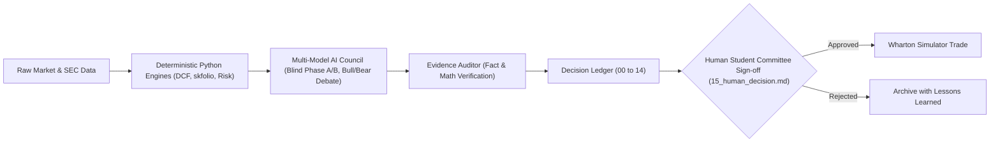

# Wharton Global High School Investment Competition: AI Use Disclosure and Governance Policy

## 1. Compliance Statement & Ethics Standard
This document formalizes the AI ethics, transparency, and attribution guidelines for our team's participation in the 2026–2027 Wharton Global High School Investment Competition.

Wharton's competition rules require that all Investment Policy Statements (IPS), Trade Rationales, and Final Strategy Reports represent the original, independent work and critical thinking of high school team members.

In strict compliance with Wharton guidelines:
- **No Direct AI-Generated Submissions**: Language models are strictly forbidden from authoring prose intended to be submitted directly as student report text.
- **Decision-Support Architecture Only**: AI is utilized strictly within `wharton-ic` as a computational and adversarial decision-support assistant—challenging student assumptions, synthesizing independent bull/bear cases, auditing numerical claims, and structuring evidence.
- **Human Sovereign Gate**: No investment decision, portfolio rebalance, or trade execution can be approved autonomously. Every action requires a student investment committee review and signature in the immutable decision ledger (`15_human_decision.md`).

---

## 2. Technical Safeguards Enforced by `wharton-ic`

1. **Principle A: Numbers from Code; Reasoning from Models**
   - Language models are hard-coded to never calculate authoritative financial arithmetic, portfolio weights, DCF formulas, WACC rates, volatility, or backtest returns.
   - Vectorized, audited Python libraries (`skfolio`, `scipy`, `pandas`, `cvxpy`, `statsmodels`) perform 100% of numerical calculations.

2. **Principle B: Zero Look-Ahead Leakage**
   - Point-in-time stores enforce strict filing date cutoffs (`filing_date <= as_of_date`). No agent or backtest can access future data.

3. **Principle C: Machine-Readable Provenance & Audit Trail**
   - Every LLM interaction is logged automatically in `outputs/ai_use_log.jsonl` with exact timestamp, provider, model name, prompt version, and role.
   - The Evidence Auditor classifies all assertions into `[VERIFIED FACT]`, `[VERIFIED CALCULATION]`, and `[INFERENCE]`, preventing ungrounded hallucinations.

---

## 3. Human-in-the-Loop Workflow

---

## 4. Disclosure for Final Report Appendix

When submitting the Final Report to Wharton, include the following statement:

> *"Our team designed an institutional-grade investment research platform (`wharton-ic`) to manage point-in-time financial data, compute deterministic DCF valuations, and optimize portfolio risk using hierarchical risk parity and Conditional Value at Risk (skfolio). Multi-model AI agents were utilized in a strictly governed decision-support role—facilitating adversarial Bull vs. Bear debate, checking fact citations against SEC filings, and stress-testing our hypotheses. All investment decisions, trade authorizations, and report narratives were conceived, debated, and authored 100% by student team members."*
