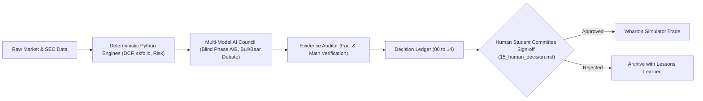

# Wharton Global High School Investment Competition: AI Use Disclosure and Governance Policy

## 1. Compliance Statement & Ethics Standard
This document formalizes the AI ethics, transparency, and attribution guidelines for our team's participation in the 2026–2027 Wharton Global High School Investment Competition.

Wharton's competition rules require that all Investment Policy Statements (IPS), Trade Rationales, and Final Strategy Reports represent the original, independent work and critical thinking of high school team members.

In strict compliance with Wharton guidelines:
- **No Direct AI-Generated Submissions**: Language models are strictly forbidden from authoring prose intended to be submitted directly as student report text.
- **Decision-Support Architecture Only**: AI is utilized strictly within `wharton-ic` as a computational and adversarial decision-support assistant—challenging student assumptions, synthesizing independent bull/bear cases, auditing numerical claims, and structuring evidence.
- **Human Sovereign Gate**: No investment decision, portfolio rebalance, or trade execution can be approved autonomously. Every action requires a student investment committee review and signature in the immutable decision ledger (`15_human_decision.md`).

---

## 2. Technical Safeguards Enforced by `wharton-ic`

1. **Principle A: Numbers from Code; Reasoning from Models**
   - Language models are hard-coded to never calculate authoritative financial arithmetic, portfolio weights, DCF formulas, WACC rates, volatility, or backtest returns.
   - Vectorized, audited Python libraries (`skfolio`, `scipy`, `pandas`, `cvxpy`, `statsmodels`) perform 100% of numerical calculations.

2. **Principle B: Zero Look-Ahead Leakage**
   - Point-in-time stores enforce strict filing date cutoffs (`filing_date <= as_of_date`). No agent or backtest can access future data.

3. **Principle C: Machine-Readable Provenance & Audit Trail**
   - Every LLM interaction is logged automatically in `outputs/ai_use_log.jsonl` with exact timestamp, provider, model name, prompt version, and role.
   - The Evidence Auditor classifies all assertions into `[VERIFIED FACT]`, `[VERIFIED CALCULATION]`, and `[INFERENCE]`, preventing ungrounded hallucinations.

---

## 3. Human-in-the-Loop Workflow

```mermaid
flowchart LR
    A["Raw Market & SEC Data"] --> B["Deterministic Python Engines (DCF, skfolio, Risk)"]
    B --> C["Multi-Model AI Council (Blind Phase A/B, Bull/Bear Debate)"]
    C --> D["Evidence Auditor (Fact & Math Verification)"]
    D --> E["Decision Ledger (00 to 14)"]
    E --> F{"Human Student Committee Sign-off (15_human_decision.md)"}
    F -->|Approved| G["Wharton Simulator Trade"]
    F -->|Rejected| H["Archive with Lessons Learned"]
```

---

## 4. Disclosure for Final Report Appendix

When submitting the Final Report to Wharton, include the following statement:

> *"Our team designed an institutional-grade investment research platform (`wharton-ic`) to manage point-in-time financial data, compute deterministic DCF valuations, and optimize portfolio risk using hierarchical risk parity and Conditional Value at Risk (skfolio). Multi-model AI agents were utilized in a strictly governed decision-support role—facilitating adversarial Bull vs. Bear debate, checking fact citations against SEC filings, and stress-testing our hypotheses. All investment decisions, trade authorizations, and report narratives were conceived, debated, and authored 100% by student team members."*

---

## 5. AI Contribution Log

Substantive AI contributions, newest last. Each entry: date, tool, what the AI did, what the students decided.

| Date (AEST) | Tool | What the AI did | Output | Student decision |
|---|---|---|---|---|
| 2026-09-29 | Claude Code (Claude Opus 5.5) | Checked a GPT (GPT-Astra, high effort) calculation of the Treasury ladder cost on the 28 Sep 2026 par curve: re-ran its code (same result: $289,003 today, $292,214 forward to 1 Jan 2027, breakeven fall 26.9bp) and estimated a 25-33% chance of a fall that large by January at 80-120bp annual rate volatility (normal approximation, ASSUMPTION). Par yields were supplied in the prompt, not yet checked against treasury.gov. | Chat analysis only | None yet |
| 2026-09-29 | Claude Code (Claude Opus 5.5) | Ran smaller-floor variants of the recommended design (2028 floor $150k/125k/100k/75k/50k/0) on the E4/E6 engine (same seed, 200,000 paths, JPM and Vanguard-like inputs, 93 history windows since 1928) to test the "reads as timid" critique. Result: each $25k less floor adds about $2-3k to the median 2033 total and costs about $9-10k at the 5th percentile and about $15k in the worst history window; under the Vanguard-like input the median does not rise. MODEL outputs, not forecasts. | `research/insight_v1/scripts/F1_floor_variants.py` | Pending team vote (D2/D6); AI recommended keeping the $150k floor |
| 2026-09-29 | Claude Code (Claude Opus 5.5) | Re-ran the D1 ladder pricing (`D1_purchase_rule.py`) on the Treasury par curve for 28 Sep 2026, downloaded from home.treasury.gov (this checks the par yields used in the GPT row above). Result: $292,418 forward to 1 Jan 2027, $7,582 headroom, 26bp break-even, 24.2% model chance of a gap by January (was $294,387 / 19bp on 25 Sep). Wrote the brief for the independent GPT check and entered it in ChatGPT; reconciled the two results (the $204 gap is day count plus short-end nodes). MODEL outputs. | `research/insight_v1/verification/ladder_2026-09-28/` (README, reconcile.py, curve CSV, D1 output) | None yet |
| 2026-09-29 | ChatGPT (GPT-6 Astra, high effort) | Independently bootstrapped the 28 Sep 2026 par curve and priced the same ladder from a blind brief (it did not see our answer): $289,003 today, $292,214 forward, 26.9bp break-even; alternative interpolation $290,965 / 31.2bp. | `research/insight_v1/verification/ladder_2026-09-28/gpt/` (code and rung prices, copied unchanged) | None yet |
| 2026-09-29 | Claude Code (Claude Opus 5.5) | Researched public sources on why Wharton runs the competition and on past finalists/winners (2019-20 to 2025-26), and drafted a self-scoresheet from the official 2026-27 Guide, IPS and Trading Note instructions. | `Knox Wharton 2026/Winning Team Portrait and Scoresheet.md` (Google Drive) | None yet |
| 2026-09-29 | Claude Code (Claude Opus 5.5), with 10 Claude sub-agent reviewers | Wrote an EXEMPLAR IPS (pitch + IPS) at the team leader's request, for reference only, not for submission. Stress-tested it in two batteries (judge roast, pre-mortem, client/co-sponsor, fact and theory audit, rival red team; then FMEA, devil's advocate, key assumptions check, backcasting) plus a final cold read, all grounded in the official case, instructions, guide and rules page. Style modelled on CFA Institute IPS elements, NBIM, Oaktree and Penn Wharton Budget Model writing. Produced v3 (pitch 46 words, IPS 488; Word paginates to 3 pages). | `Caplet Investments/AI Outputs/IPS Exemplar v3 (AI, not for submission).docx` (Drive) | Team writes its own IPS in its own words; D6 share still pending |
| 2026-09-29 | Claude Code (Claude Opus 5.5), with 9 further Claude sub-agent reviewers | Rewrote the exemplar IPS to remove AI-style patterns (measured with a script: colons/semicolons, slogan sentences, parallel pairs, contrast framing), then stress-tested v4-v6 against the five official criteria with three judge personas (Wharton FNCE 2050 student, LDI portfolio manager, Wharton Global Youth evaluator), an AI-voice detector and fact-regression checks. Final v7: pitch 47 words, IPS 489; panel ~37/50; Word paginates to 3 pages. Trade-off figures from F1_floor_variants.py (JPM 2026 LTCMA). | `Caplet Investments/AI Outputs/IPS Exemplar v7 (AI, not for submission).docx` (Drive) | Exemplar only; team writes its own IPS |
| 2026-09-29 | Claude Code (Claude Opus 5.5), with further Claude sub-agent reviewers | Reworked the exemplar IPS (v8-v12) into a CFA-style policy register after reading real IPS documents (CFA Institute model passages, Oklahoma TRS IPS, UC Regents IPS) and investor letters (Oaktree, Berkshire); added liability-driven terminology; removed a detailed percentile calculation to follow the IPS instruction on calculations. Tested with three blind voice tests against human IPS passages (AI draft still rated ~60% likely AI vs 5-15% for human text), a strict compliance audit and judge panels (~36-37.5/50). | `Caplet Investments/AI Outputs/IPS Exemplar v12 (AI, not for submission).docx` (Drive) | Exemplar only; students must rewrite in their own words |
