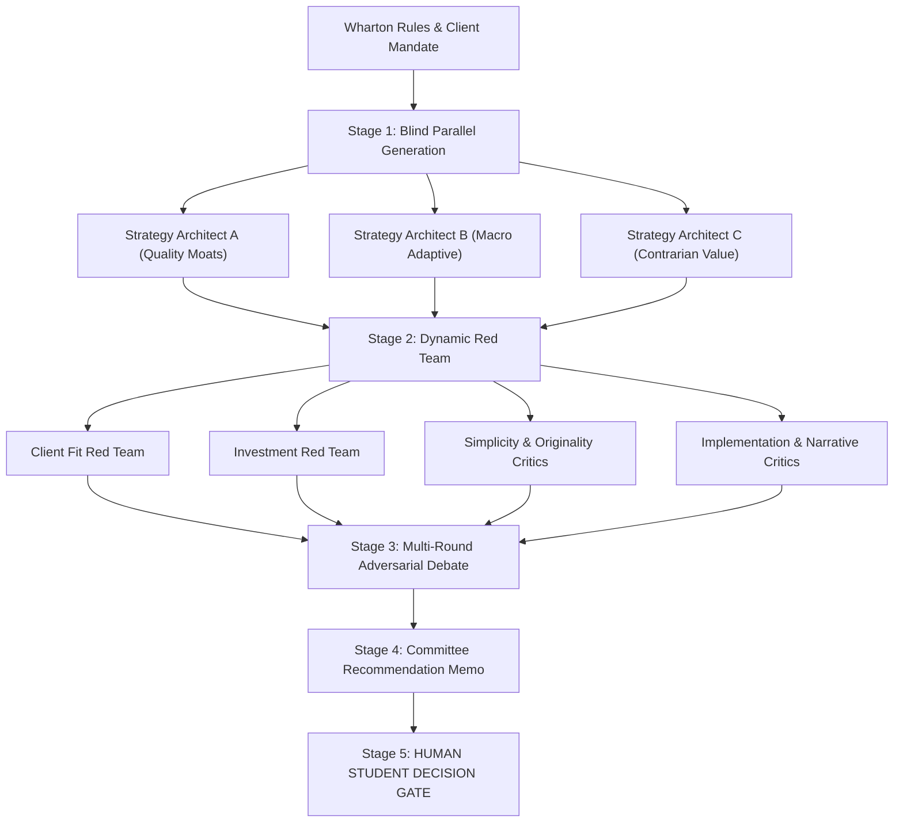
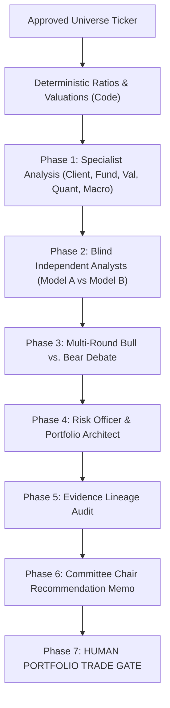

# Agent Graph Architecture Specification (Caplet V2.1)

Adapted from `TauricResearch/TradingAgents`, `wharton-ic` employs an explicit graph-based orchestration pattern designed specifically for the Wharton Global High School Investment Competition.

---

## 1. Why a Lightweight Internal Graph?

Rather than adding heavy third-party framework dependencies (like Autogen or complex LangGraph runtimes) that add deployment fragility and opaque execution loops, Caplet V2.1 implements a lightweight, deterministic graph engine in `src/wharton_ic/orchestration/graph.py`.

### Key Capabilities:
- **Discrete Node Boundaries**: Each agent operates within an isolated node with explicit input and output typing.
- **Resumable Checkpointing**: Deterministic thread hashing allows long council runs to resume at the exact stage of failure.
- **Blind Phase Isolation**: Parallel nodes (e.g. Strategy Architects A, B, C or Independent Analysts A, B) cannot inspect peer node state during phase 1.
- **Fail-Closed Partial Execution**: On provider outages, nodes report `PARTIAL_COUNCIL` rather than substituting hallucinated responses.
- **First-Class Human Decision Gates**: The graph halts cleanly when human sign-off is required.

---

## 2. Strategy Council Graph Flow

---

## 3. Security Research Council Graph Flow

