# System Architecture & Technical Specifications: `wharton-ic`

## 1. High-Level Architecture Overview

`wharton-ic` is an institutional-quality investment operating system engineered specifically for high school teams competing in the Wharton Global High School Investment Competition.

The architecture strictly enforces:
```
CLIENT MANDATE → APPROVED UNIVERSE → POINT-IN-TIME DATA → SCREENING → DETERMINISTIC VALUATION → PORTFOLIO OPTIMIZATION → RISK DECOMPOSITION → MULTI-MODEL COUNCIL → EVIDENCE AUDIT → DECISION LEDGER → HUMAN SIGN-OFF → MONITORING → REPORT PACK
```



```mermaid
flowchart TD
    subgraph ConfigLayer ["Configuration Layer (YAML)"]
        C1["client_mandate.yaml"]
        C2["competition.yaml"]
        C3["risk.yaml"]
        C4["portfolio.yaml"]
        C5["models.yaml"]
    end

    subgraph DataLayer ["Point-in-Time Data Layer"]
        D1["ApprovedUniverseEngine\n(Wharton Official Securities)"]
        D2["YFinanceProvider\n(Cached Market Prices)"]
        D3["EdgarProvider\n(SEC Company Facts)"]
        D4["PointInTimeStore\n(filing_date <= as_of_date)"]
    end

    subgraph QuantLayer ["Deterministic Quantitative Engines"]
        Q1["FundamentalsForensics\n(ROIC, Accruals, Z-Score)"]
        Q2["FactorScreeningEngine\n(Winsorized Sector-Neutral Z)"]
        Q3["ValuationEngine\n(DCF, WACC, Reverse DCF, Comps)"]
        Q4["skfolio PortfolioOptimizer\n(HRP, CVaR, MinVol, MaxSharpe)"]
        Q5["CVXPY ConstraintProjector\n(Box bounds, Sector caps)"]
        Q6["WalkForwardBacktester\n(Rolling out-of-sample)"]
        Q7["ScenarioStressEngine\n(Fat-tailed Student-t Monte Carlo)"]
    end

    subgraph CouncilLayer ["Multi-Model AI Council (Decision-Support)"]
        A1["Blind Phase A\n(Independent Model A)"]
        A2["Blind Phase B\n(Independent Model B)"]
        A3["Client Steward Review"]
        A4["Adversarial Bull vs Bear Debate"]
        A5["Risk Officer Review"]
        A6["Evidence Auditor\n(Fact vs Math Check)"]
        A7["Committee Chair Memo"]
    end

    subgraph GovernanceLayer ["Auditability & Governance"]
        L1["DecisionLedger\n(00_metadata to 14_verdict)"]
        L2{"Human Approval Gate\n(15_human_decision.md)"}
        L3["PortfolioMonitor\n(Drift & Thesis alerts)"]
    end

    subgraph OutputLayer ["Wharton Deliverables"]
        R1["outputs/report_pack/\n(Verified CSV/MD Tables)"]
        R2["outputs/charts/\n(Publication Visuals)"]
        R3["AI_USE.md & ai_use_log.jsonl\n(Ethics & Provenance)"]
    end

    ConfigLayer --> DataLayer
    DataLayer --> QuantLayer
    QuantLayer --> CouncilLayer
    CouncilLayer --> GovernanceLayer
    GovernanceLayer --> OutputLayer
```

---

## 2. Core Subsystems

### 2.1 Configuration Layer (`config/`)
All parameters governing the client mandate, competition trading rules, portfolio risk limits, optimization objectives, and LLM model selections are defined declaratively in version-controlled YAML files:
- `client_mandate.yaml`: Client background, 10-year horizon, 8-10% return goal, 2% cash yield, values, exclusion sectors, and portfolio roles.
- `competition.yaml`: Official Wharton rules (10-20 stocks, 2.5% min, 15.0% max weight, 25.0% sector cap, 0.5-10% cash buffer, long-only equity).
- `risk.yaml`: Target volatility (14%), maximum drawdown threshold (20%), 95% CVaR limit, and crisis replay definitions.
- `models.yaml`: Multi-model orchestration routing (Anthropic Claude 3.5 Sonnet, OpenAI GPT-4o, Google Gemini 1.5 Pro, and deterministic mock fallbacks).
- `portfolio.yaml`: Specification of primary optimizer (`hrp`) and comparative models.

### 2.2 Point-in-Time Data Engine (`src/wharton_ic/data/`)
Prevents look-ahead bias across all historical backtests and research workflows:
- `PointInTimeStore`: Enforces that any financial statement or market price timestamped after the simulation's `as_of_date` is strictly quarantined.
- Uses SEC filing dates (public availability) rather than period end dates to prevent restatement leakage.
- Caches all downloaded series into Parquet format in `data/cache/` for instant, reproducible offline execution.

### 2.3 Deterministic Valuation Engine (`src/wharton_ic/valuation/`)
Adheres strictly to Principle A ("Numbers from code; reasoning from models"):
- **WACC**: Computes cost of equity via CAPM ($R_e = R_f + \beta \times \text{ERP}$), after-tax cost of debt, and capital structure weights.
- **Multi-Stage DCF**: Generates explicit year-by-year cash flow projections (Revenue $\to$ Operating Income $\to$ NOPAT $\to$ Reinvestment $\to$ Free Cash Flow).
- **Gordon Growth Terminal Value**: Implied terminal value using conservative perpetual growth ($g = 2.0\% - 3.0\%$) and exit multiple cross-checks.
- **Reverse DCF**: Solves numerically via Brent's root-finding algorithm for the exact terminal revenue growth rate priced into the current stock price.
- **2D Sensitivity Matrix**: Generates a 5x5 grid varying WACC ($\pm 150$ bps) and terminal growth rate ($\pm 100$ bps).
- **Comparable Multiples (Comps)**: Computes peer median and mean P/E, EV/EBITDA, and P/S multiples to derive relative valuation ranges.

### 2.4 Portfolio Construction & Optimization (`src/wharton_ic/portfolio/`)
Integrates `skfolio` with convex quadratic programming to enforce strict Wharton constraints:
- Implements 8 competing portfolio models side-by-side: Equal Weight, Inverse Volatility, Factor-Weighted, Max Sharpe, Min Volatility, Mean-CVaR, Risk Budgeting, and Hierarchical Risk Parity (HRP).
- Projections onto the constraint set using CVXPY:
  $$\min_w \|w - w_{\text{raw}}\|^2 \quad \text{s.t.} \quad \sum w_i = 1 - c, \quad w_{\min} \le w_i \le w_{\max}, \quad \sum_{i \in S} w_i \le \text{Cap}_S$$

### 2.5 Walk-Forward Backtester (`src/wharton_ic/backtest/`)
- Out-of-sample rolling estimation window (e.g. 252 trading days).
- Quarterly rebalancing with realistic turnover transaction costs and slippage (5 bps).
- Compares strategies against the broad market benchmark (SPY ETF) and Equal Weight.

### 2.6 Multi-Model AI Council (`src/wharton_ic/council/`)
- **Blind Phase A/B**: Independent models evaluate the asset without observing each other's outputs.
- **Adversarial Debate**: Bull Researcher vs. Bear Researcher debate grounded in verified financial numbers.
- **Evidence Auditor**: Reconciles claims against deterministic engine outputs and tags statements as `[FACT]`, `[CALCULATION]`, or `[INFERENCE]`.
- **Committee Chair**: Synthesizes the debate into a formal committee recommendation memo.

### 2.7 Immutable Decision Ledger (`src/wharton_ic/decisions/`)
Every potential holding is archived in `decisions/YYYY-MM-DD_TICKER/` across 16 standardized artifacts (`00_metadata.json` to `15_human_decision.md`). The security cannot be purchased on the simulator without a student signature in `15_human_decision.md`.

### 2.8 Report Pack Generator (`src/wharton_ic/reporting/`)
Exports verified quantitative tables (CSV and Markdown), high-resolution charts (PNG), figure captions, and AI ethics audit trails into `outputs/report_pack/`.
