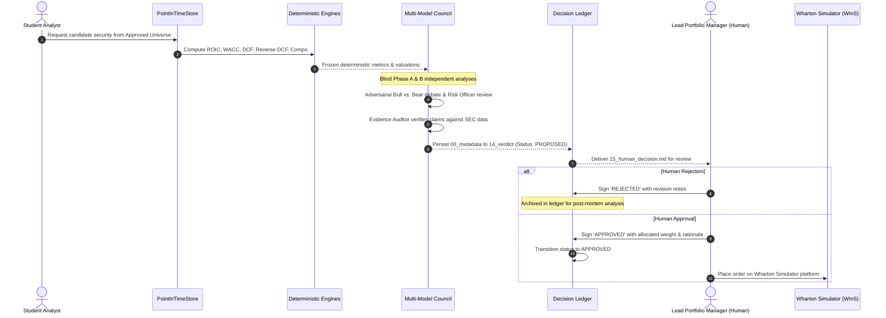

# Investment Decision Process & Governance Manual: `wharton-ic`

This document defines the formal student-governed investment committee protocol enforced by `wharton-ic`.

---

## 1. Decision Philosophy

No security is "good" in isolation.
Every capital allocation decision must be justified through the lens of:
1. **Client Mandate Fit**: Why does this stock belong in THIS client's portfolio?
2. **Margin of Safety**: Is the market price discount to intrinsic DCF value supported by empirical evidence?
3. **Portfolio Tail Risk**: Does adding this asset improve or degrade overall portfolio CVaR and diversification?
4. **Adversarial Scrutiny**: Have the Bear thesis and failure modes been rigorously debated and mitigated?
5. **Human Accountability**: Has a student portfolio manager personally reviewed and approved the thesis?

---

## 2. Step-by-Step Decision Lifecycle



---

## 3. The 16 Immutable Decision Artifacts

Every candidate security evaluated by the team receives a dedicated directory under `decisions/YYYY-MM-DD_TICKER/`:

| Artifact | Format | Contents |
|---|---|---|
| `00_metadata.json` | JSON | Decision ID, ticker, date, role, proposed weight, governance status, approved by. |
| `01_client_fit.json` | JSON | Structured scores on horizon fit, liquidity, risk capacity, values, and strategic role. |
| `02_sources.json` | JSON | Exact source document pointers, SEC URLs, filing dates, and verification hashes. |
| `03_fundamentals.json` | JSON | Audited fundamental ratios (ROIC, ROE, FCF conversion, Net Debt/EBITDA, Altman Z). |
| `04_valuation.json` | JSON | DCF cash flow schedules, WACC inputs, terminal value, and 2D sensitivity matrix. |
| `05_quant.json` | JSON | Cross-sectional factor rankings, momentum, volatility, beta, and tracking error. |
| `06_macro.md` | Markdown | Macroeconomic context, interest rate regime, and industry structure analysis. |
| `07_independent_model_A.md` | Markdown | Blind independent research report authored by Model Family A (e.g. OpenAI GPT-4o). |
| `08_independent_model_B.md` | Markdown | Blind independent research report authored by Model Family B (e.g. Anthropic Claude). |
| `09_bull_case.md` | Markdown | Strongest evidence-backed upside thesis, secular catalysts, and variant perception. |
| `10_bear_case.md` | Markdown | Adversarial failure modes, competitive threats, and explicit thesis exit conditions. |
| `11_risk.json` | JSON | Marginal volatility contribution, marginal CVaR contribution, and max drawdown. |
| `12_portfolio_impact.json` | JSON | Post-trade sector concentration, correlation delta, and diversification change. |
| `13_evidence_audit.json` | JSON | Classification of all report assertions into `[FACT]`, `[CALCULATION]`, and `[INFERENCE]`. |
| `14_committee_verdict.json` | JSON | Investment committee chair synthesis, unresolved debate points, and recommendation. |
| `15_human_decision.md` | Markdown | Mandatory student signature, allocated weight, committee debate notes, approval date. |

---

## 4. Human Approval Gate (`15_human_decision.md`)

No investment recommendation generated by AI or code is authoritative until signed.
The system programmatically enforces this via `decision_ledger.verify_human_approval(ticker)`:
```markdown
# Human Investment Committee Decision Record

**Security**: MSFT
**Allocated Weight**: 8.5%
**Governance Status**: APPROVED
**Signed At**: 2026-09-19T13:00:00Z

---

## Student Team Committee Action:

- **Decision**: APPROVED
- **Approved By (Student Name)**: Ray (Lead Student Portfolio Manager)
- **Final Allocated Weight**: 8.5%
- **Rationale & Revisions**: Approved unanimously after debating software operating leverage vs AI capex intensity. ROIC of 24.5% provides ample margin of safety.
- **Approval Date**: 2026-09-19
```
If a student has not signed with `APPROVED`, any attempt to trade or include the asset in the active portfolio raises a `HumanApprovalRequiredError`.
