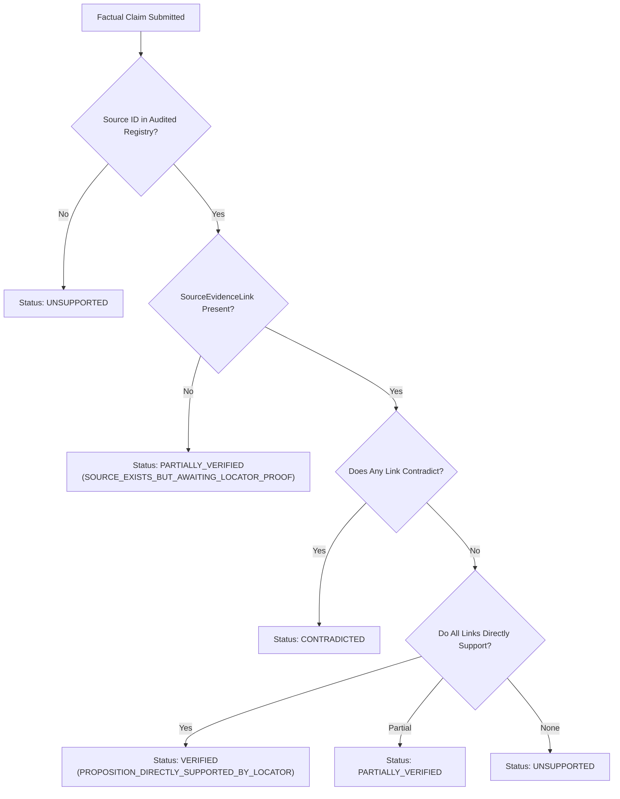

# Proposition-Level Evidence Verification Specification (Caplet V2.1)

Adapted from `AI4Finance-Foundation/FinRobot` and `TauricResearch/TradingAgents`.

---

## 1. The Core Lineage Invariant

> **`SOURCE_EXISTS != SOURCE_SUPPORTS_CLAIM`**

In superficial AI systems, an agent cites a legitimate SEC filing ID (e.g. `10K-2025-MSFT`) or case study paragraph, and the system immediately marks the claim as "Verified" simply because the referenced document exists in the database.

In Caplet V2.1, this vulnerability is completely eliminated. A factual proposition is only `VERIFIED` when an explicit `SourceEvidenceLink` connects the claim to a specific locator in the document, and the link's `support_type` confirms `DIRECT_SUPPORT`.

---

## 2. Evidence Link Data Model

```python
class SourceEvidenceLink(BaseModel):
    link_id: str
    source_id: str                 # e.g., '10K-2025-MSFT'
    locator: str                   # e.g., 'Page 42, Consolidated Balance Sheet, Row 8'
    extracted_datum: str           # e.g., 'Cash and cash equivalents: $24,500M'
    extraction_method: str         # EXACT_MATCH, DETERMINISTIC_CALCULATION
    claim_id: str
    support_type: SourceSupportType # DIRECT_SUPPORT, PARTIAL_SUPPORT, CONTEXT_ONLY, CONTRADICTS, NO_SUPPORT
    audit_notes: Optional[str]
```

---

## 3. Verification State Machine



---

## 4. Legacy Auditor Production Isolation

The legacy `EvidenceAuditor` class (which relied on regex parsing of `[FACT]` or `[CALCULATION]` tags) is **strictly forbidden in production mode**. If invoked while `WHARTON_MODE=production`, it immediately raises a `RuntimeError`. All production claim audits must flow through `EvidenceLineageAuditor`.
