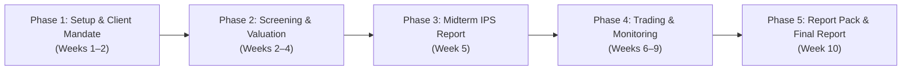

# Wharton Competition Operational Workflow Guide: `wharton-ic`

This playbook guides student team members through every phase of the 2026–2027 Wharton Global High School Investment Competition using `wharton-ic`.

---

## Competition Timeline & Milestone Overview



---

## Phase 1: Ingest Official Files & Calibrate Client Mandate (Weeks 1–2)

1. **Place Official Competition Files**:
   When Wharton releases the 2026–27 case study and approved stock list, place them into `competition/official/`:
   ```bash
   cp ~/Downloads/client_case.pdf competition/official/
   cp ~/Downloads/approved_securities.csv competition/official/
   ```
2. **Ingest and Validate Universe**:
   ```bash
   wharton-ic ingest-official
   ```
   *Verifies tickers, GICS sectors, market caps, and active listing status.*

3. **Configure the Client Mandate**:
   Open [config/client_mandate.yaml](file:///Users/ray/Research/Wharton%20Investment%20Competition%2026-27/config/client_mandate.yaml) and transcribe the client's:
   - Financial goals (target return, cash flow needs)
   - Investment horizon
   - Risk capacity and tolerance
   - Values, mission, and sector exclusions
   - Strategic portfolio roles (Core Compounders, Secular Growth, Defensive Cash Generators)

---

## Phase 2: Systematic Screening & Deep Intrinsic Valuation (Weeks 2–4)

1. **Execute Multi-Factor Cross-Sectional Screening**:
   ```bash
   wharton-ic screen --model wharton_garp --top-n 15
   ```
   Compare ranking outputs against alternative models:
   ```bash
   wharton-ic screen --model pure_quality
   wharton-ic screen --model conservative_defensive
   ```

2. **Conduct Deep Fundamental Research**:
   ```bash
   wharton-ic research MSFT
   ```
   *Inspects ROIC, Sloan accruals, operating margins, FCF conversion, and Altman Z-scores.*

3. **Run Deterministic Multi-Stage DCF & Reverse DCF**:
   ```bash
   wharton-ic value MSFT
   ```
   *Outputs WACC hurdle rate, Base/Bear/Bull intrinsic prices, and reverse DCF market-implied growth rate.*

---

## Phase 3: Adversarial AI Council & Human Sign-Off (Weeks 3–5)

1. **Convene Multi-Model Council**:
   ```bash
   wharton-ic propose MSFT
   ```
   *Executes blind Phase A/B independent assessments, Bull vs. Bear debate, Risk review, and Evidence Audit. Freezes outputs in `decisions/YYYY-MM-DD_MSFT/`.*

2. **Student Committee Deliberation & Approval Gate**:
   Open [decisions/YYYY-MM-DD_MSFT/15_human_decision.md](file:///Users/ray/Research/Wharton%20Investment%20Competition%2026-27/decisions):
   - Review disagreements between Bull and Bear models.
   - Verify that all claims have passed the Evidence Audit.
   - Enter student team signature, allocated weight, and committee rationale.
   - Change `- **Decision**: PENDING` to `- **Decision**: APPROVED`.

3. **Verify Governance Status**:
   ```bash
   wharton-ic review MSFT
   ```

---

## Phase 4: Portfolio Construction, Stress Testing, & Simulator Trading (Weeks 5–9)

1. **Optimize Portfolio Allocations using `skfolio`**:
   ```bash
   wharton-ic portfolio
   ```
   *Compares 8 optimization models (HRP, CVaR, Risk Budgeting, Max Sharpe, Min Vol, Equal Weight) with Wharton 15% asset and 25% sector caps.*

2. **Walk-Forward Out-of-Sample Backtesting**:
   ```bash
   wharton-ic backtest
   ```
   *Validates rolling quarterly performance, turnover friction, Sharpe ratios, and beta vs. SPY.*

3. **Run Stress Testing & Fat-Tailed Monte Carlo**:
   ```bash
   wharton-ic stress
   ```
   *Evaluates 2008 GFC, 2020 Covid, and 2022 rate shocks alongside 5,000-path Student-t Monte Carlo forward projections.*

4. **Execute on WInS Platform**:
   Student portfolio managers place approved trades on the Wharton Investment Simulator adhering strictly to target weights.

5. **Daily Monitoring & Drift Alerts**:
   ```bash
   wharton-ic monitor
   ```
   *Alerts team to position drift > 3%, sector breaches, single-stock drawdowns > 15%, or outdated research.*

---

## Phase 5: Exporting the Wharton Report Pack (Weeks 9–10)

1. **Generate Verified Tables & Publication Charts**:
   ```bash
   wharton-ic export-report-pack
   ```
2. **Review Generated Deliverables in `outputs/report_pack/`**:
   - `01_portfolio_weights.md`: Audited allocation table with Wharton limits.
   - `02_risk_diagnostics.md`: Formal risk and return profile.
   - `03_optimizer_comparison.csv`: Statistical comparison proving why HRP/CVaR was selected over naive Markowitz.
   - `04_decision_timeline.md`: Complete audit trail of team investment journey.
   - `05_figure_captions.md`: Academic captions for charts embedded in the Final Report.
   - `06_executive_summary.md`: Verified quantitative brief for student authoring.
3. **Embed High-Resolution Charts from `outputs/charts/`**:
   - Figure 1: Asset Allocation & Sector Concentration vs. Wharton Cap.
   - Figure 2: Model Comparison (Efficient Frontier & Baselines).
   - Figure 3: Fat-Tailed Monte Carlo Projection Cone.
   - Figure 4: Portfolio Correlation Heatmap.
4. **Append AI Disclosure**:
   Attach the transparency disclosure from [docs/AI_USE.md](file:///Users/ray/Research/Wharton%20Investment%20Competition%2026-27/docs/AI_USE.md) and reference `outputs/ai_use_log.jsonl`.
